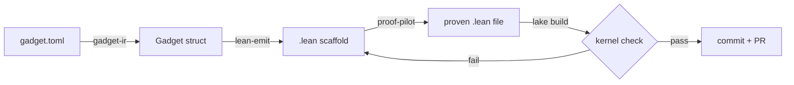

# architecture

## data flow

## crates

### gadget-ir

Minimal intermediate representation for ZK constraint systems. A `Gadget` is:

- A prime modulus (decimal string, arbitrary precision)
- A list of named witness variables
- A list of polynomial constraints (each a sum of monomial terms equal to zero)

The IR deliberately does not reference any ZK framework (arkworks, halo2, Ragu, etc.). It is the contract between the constraint source and the Lean emitter.

Serialization format is TOML via `serde`.

### lean-emit

Takes a `Gadget` and emits a Lean 4 source file containing:

- Mathlib imports
- Variable declarations for the prime field and witnesses
- Constraint hypotheses as theorem preconditions
- A soundness theorem statement with `sorry` as the proof body

The emitted file is self-contained. `lake build` should typecheck it (modulo the `sorry`).

### proof-pilot

Drives the LLM to close the `sorry` in an emitted Lean file. The loop:

1. Read the current `.lean` file
2. Run `lake build`, capture errors
3. Send the file + errors to `claude` with the system prompt from `prompts/lean-prover.md`
4. Extract the suggested proof from the response
5. Patch the file
6. Repeat until `lake build` exits 0 or the iteration budget is exhausted

Hard constraints enforced by the pilot:
- Never modify the theorem statement
- Never introduce `sorry`, `axiom`, or `native_decide`
- Revert after 3 stuck iterations on the same error
- 20-iteration cap with `NOTES.md` on failure

## why this works

Lean's kernel is a total, decidable checker. `lake build` returning 0 means the proof is valid — not "tests passed," not "looks right," but *actually proven from axioms*. The LLM cannot fake this without using `sorry` or `axiom`, which we grep-block at the pre-commit hook and CI level.

This makes the feedback loop qualitatively different from test-driven LLM coding.
